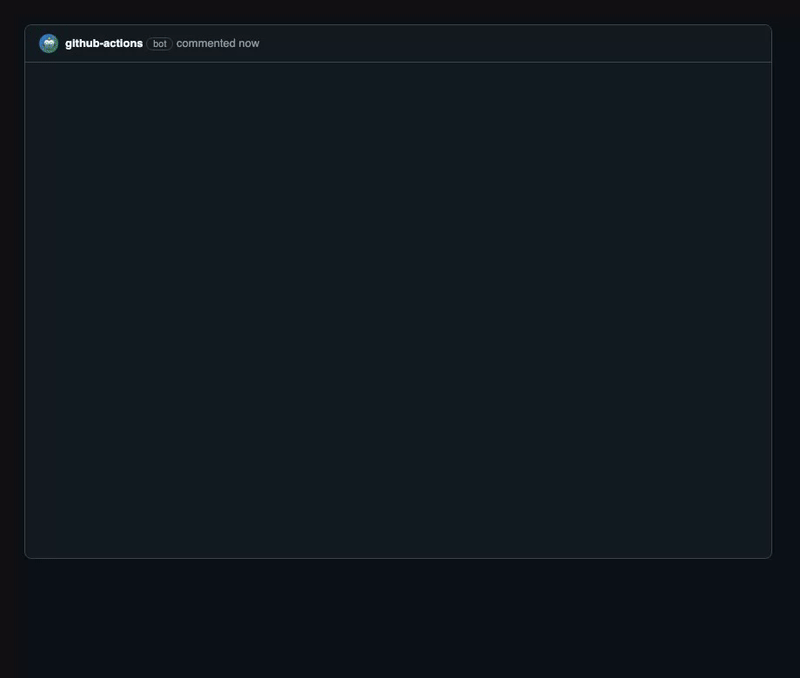

# playwright-ai-triage

[](https://www.npmjs.com/package/playwright-ai-triage)
[](https://www.npmjs.com/package/playwright-ai-triage)
[](https://github.com/flaketrace/playwright-ai-triage/actions/workflows/ci.yml)
[](LICENSE)

A [Playwright](https://playwright.dev) reporter that classifies every test failure with an LLM —
`REAL_BUG` / `FLAKY` / `SELECTOR_DRIFT` / `ENV_ISSUE` — and posts a short, human-readable summary
to stdout, a GitHub PR comment, or Slack.



_Illustrative example of the output format (static version:
[hero-comment.png](docs/assets/hero-comment.png)) — in CI the summary lands as a single
auto-updating comment on your PR (as exercised by this repo's own integration CI on every pull request)._

Self-hosted by design: you bring your own Anthropic API key, and your test results are processed
inside your own CI. There is no hosted platform behind this package. Failure text is sent to two
kinds of destinations, both under your control: the Anthropic API (for classification, minimal
redacted text only) and the outputs you enable (your GitHub PR, your Slack webhook).

## Usage

```bash
npm i -D playwright-ai-triage
```

```ts
// playwright.config.ts
export default defineConfig({
  reporter: [['list'], ['playwright-ai-triage']],
});
```

One line in your config, `ANTHROPIC_API_KEY` in your CI env — that's the whole setup.
(On a clean machine: install → first triage in well under a minute, plus the usual
one-time Playwright browser download.)

For the GitHub PR comment specifically, the workflow token also needs write access to pull
requests — many organisations default new repositories to read-only workflow permissions, and
without this the comment is skipped (the reporter says so, and your build stays green):

```yaml
permissions:
  contents: read
  pull-requests: write
```

## Configuration

The full option surface (auto-detection covers everything else):

| Option         | Default             | Meaning                                                         |
| -------------- | ------------------- | --------------------------------------------------------------- |
| `model`        | current Haiku alias | Anthropic model used for classification                         |
| `outputs`      | auto-detect         | any of `stdout`, `github`, `slack`                              |
| `includeDom`   | `false`             | send a redacted DOM snippet with each failure                   |
| `maxFailures`  | `25`                | send at most this many failures to the API per run              |
| `dryRun`       | `false`             | fixture classifications, no API call                            |
| `failSilently` | `true`              | `false` also surfaces reporter errors as CI warning annotations |
| `sinkUrl`      | unset               | opt-in: POST each run's triage results as JSON to your own URL  |

Environment: `ANTHROPIC_API_KEY` (required for classification), `GITHUB_TOKEN` (automatic in
GitHub Actions), `SLACK_WEBHOOK_URL` (enables the Slack output), `GIT_DIFF_SUMMARY` (optional
opt-in: provide a diff summary to include as classification evidence; nothing diff-related is
sent when unset), `AI_TRIAGE_SINK_URL` (same as `sinkUrl`; the option wins when both are set),
`AI_TRIAGE_SINK_TOKEN` (optional `Authorization: Bearer` header for the sink — tokens are
env-only and never belong in a config file).

### HTTP sink (opt-in)

When `sinkUrl` is set, the reporter POSTs one JSON document per run to that URL after
classification: schema `ai-triage-sink/v1` with run metadata (shard, and repository / branch /
commit / PR number when running in GitHub Actions), a per-class summary with the run's API
cost, and every failure's payload, classification, and stable fingerprint (plus, when
applicable, `reused: true` for classifications carried over from the previous run and `draws`
with the per-draw results wherever voting ran). It fires on keyless
runs too (statuses and fingerprints are still useful data), is skipped in `dryRun`, times out
after 10 seconds, and a sink failure warns without ever affecting the build. Nothing is sent
when `sinkUrl` is unset.

The reporter never fails your build. No API key? It degrades to a plain failure summary. API
down? Failures are reported as `UNCLASSIFIED`. Any internal error is logged as a warning and the
run exits normally.

## What data is sent where

Failures a script can decide never reach the API at all — they are classified locally, for
free: passed-on-retry (`FLAKY`), pure network-error signatures (`ENV_ISSUE`), and explicit
expired-credential errors (`ENV_ISSUE`). The model is reserved for failures that need judgment,
such as assertion diffs and locator timeouts (selector drift vs flake).

On pull requests, a failure that already appeared in the previous run (same fingerprint) with a
recorded verdict is not re-sent either: the verdict is reused from the reporter's own previous
comment, for free, so a persisting failure keeps one stable class instead of being re-judged
every push. (Fail-closed `UNCLASSIFIED` outcomes are never reused — those failures are
re-judged until a verdict lands.) Failures a PR run judges for the first time are classified
three times and the majority is recorded — roughly triple the per-failure cost on first sight,
repaid by later pushes reusing the recorded verdict at no cost.

Sent to the Anthropic API per remaining failure (text only, secret-patterns redacted): test id, test
title, file path, line number, error message, stack (truncated, `node_modules` frames
stripped), failing step title, retry history with the retry-then-passed flag and a short
redacted error head for each earlier attempt that failed differently (so a timeout preceded
by 500s reads as what it is), the deterministic
heuristic prior (when one exists), duration, and — only if you opt in — a redacted DOM snapshot
(from Playwright's own error-context attachment) and whatever you place in `GIT_DIFF_SUMMARY`.

Sent to your own endpoint only if you set `sinkUrl`: the same redacted payloads plus their
classifications and fingerprints (see "HTTP sink" above). Nothing is sent when unset.

Never sent anywhere: screenshots, videos, traces, your source code beyond the stack frames above.
Media files are referenced by local path in the summary, never uploaded.

## After a fix

Re-run just the failures — not the whole suite:

```bash
npx playwright test --last-failed        # or --grep the affected spec
```

The PR comment upserts in place: the fixed finding moves to ✅ resolved, anything still
failing stays ⏳ persisting without being re-announced, and a fully green re-run flips the
comment to "all clear ✅". Your next scheduled full run re-validates everything else.

## How this compares to hosted platforms

Hosted test-analytics platforms (Currents, TestDino, Trunk, and similar) and this reporter
solve overlapping problems in different shapes:

|                        | Hosted platforms               | `playwright-ai-triage`                                                                       |
| ---------------------- | ------------------------------ | -------------------------------------------------------------------------------------------- |
| Where failure logs go  | the vendor's cloud             | no vendor platform — redacted text goes only to the Anthropic API and the outputs you enable |
| Account / onboarding   | vendor account + project setup | no new account — one reporter line and your own Anthropic key                                |
| Pricing                | vendor plans (free tiers vary) | free (MIT); you pay your own model usage, printed per run                                    |
| Cross-run history      | yes — dashboards and trends    | no dashboards or trends, by design; a hosted add-on is on the [roadmap](docs/ROADMAP.md)     |
| Failure classification | varies by vendor               | local deterministic heuristics + LLM; falls back to `UNCLASSIFIED` rather than guessing      |

If you want dashboards and long-term analytics today, a hosted platform is the right tool. If
you want your next red PR triaged with nothing leaving your control beyond the model API you
already configure, this is.

## Known limitations

- Sharded runs (`--shard`): each shard posts its own summary section; cross-shard merging is out
  of scope for v1.
- Fork PRs: GitHub Actions gives forked-repo workflows a read-only `GITHUB_TOKEN`, so the PR
  comment output is skipped there (stdout still works). Maintainer-branch PRs are unaffected.
- Non-GitHub CI: `stdout` and `slack` outputs work everywhere; the PR comment output is GitHub
  only.

## License

[MIT](LICENSE)

---

Playwright is a trademark of Microsoft Corporation. This project is community-built and is not
affiliated with or endorsed by Microsoft.
