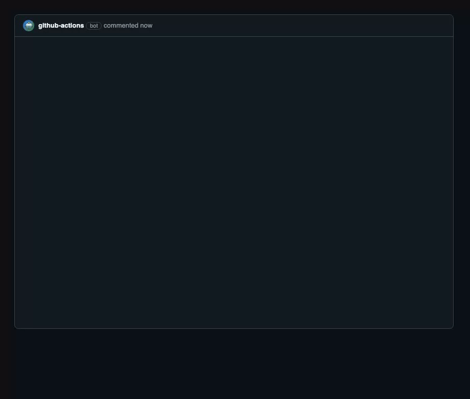

# playwright-ai-triage

[](https://www.npmjs.com/package/playwright-ai-triage)
[](https://www.npmjs.com/package/playwright-ai-triage)
[](https://github.com/flaketrace/playwright-ai-triage/actions/workflows/ci.yml)
[](LICENSE)

A CI run goes red. Someone has to work out why: read the assertion, check whether it's a
known flake, decide whether a locator moved, or just re-run and hope. That decision is a
judgment call, not something a rule can encode — the same "element not found" error is
produced by a renamed selector, a disabled feature flag, a backend outage, and a genuine
bug that broke rendering. Deterministic heuristics catch the easy fraction of this
(retried-then-passed is very likely `FLAKY`; a bare network-error signature is very likely
`ENV_ISSUE`) but the cases that actually cost engineering time — the ambiguous ones — sit
exactly where heuristics run out.

`playwright-ai-triage` is a [Playwright](https://playwright.dev) reporter that classifies
every test failure into one of five explicit classes — `REAL_BUG`, `FLAKY`,
`SELECTOR_DRIFT`, `ENV_ISSUE`, `UNCLASSIFIED` — using deterministic heuristics first (free,
and correct often enough to skip the model entirely) and an LLM judge for whatever the
heuristics can't decide, then posts a short, human-readable summary to stdout, a GitHub PR
comment, or Slack.



_Illustrative example of the output format (static version:
[hero-comment.png](docs/assets/hero-comment.png)) — in CI the summary lands as a single
auto-updating comment on your PR (as exercised by this repo's own integration CI on every pull request)._

This is LLM-as-judge, not LLM-as-magic: the taxonomy is fixed and closed, the evidence the
judge is allowed to see is enumerated (see [What data is sent where](#what-data-is-sent-where)),
and the prompt is versioned and evaluated like any other piece of logic that changes
behavior — [`CONTRIBUTING.md`](CONTRIBUTING.md) requires eval evidence, not intuition,
before a prompt change merges. See [How much to trust this](#how-much-to-trust-this) below
for what "evaluated" means in practice and what the judge still gets wrong, and
[`docs/adr/`](docs/adr/) for why the taxonomy, the LLM-vs-heuristics split, and the reliability
measurement itself are shaped the way they are.

Self-hosted by design: you bring your own Anthropic API key, and your test results are processed
inside your own CI. There is no hosted platform behind this package. Failure text is sent to two
kinds of destinations, both under your control: the Anthropic API (for classification, minimal
redacted text only) and the outputs you enable (your GitHub PR, your Slack webhook).

## How much to trust this

Self-reported model confidence is known to be poorly calibrated — a judge that says "0.9
confidence" is not 90% likely to be right just because it said so. This project doesn't use
that number for anything measured here. What it measures instead is **self-consistency**: N
independent draws of the same failure at temperature > 0, and how often those draws agree
with each other. Disagreement across draws is an empirically-grounded signal that the input
was ambiguous to the model; a self-reported score is not.

Two tools measure judge accuracy against human-verified ground truth, computing the same
statistics both times: overall accuracy, per-class precision/recall/F1 (reported per class,
not blended — `FLAKY` vastly outnumbers `REAL_BUG` in real projects, and a blended number
hides a judge that's only good at the common class), a confusion matrix, and a 95%
Wilson-score confidence interval on every proportion, so a report built from 15 cases isn't
read with the same confidence as one from 1,500.

- `npx playwright-ai-triage eval` measures against **your own** labeled failures. This is
  the number that matters for your codebase — nobody else's failure shapes substitute for
  it. See [Adding your own cases to the eval dataset](#adding-your-own-cases-to-the-eval-dataset).
- `npm run eval:golden` measures against [`evals/`](evals/README.md), a public benchmark of
  hand-picked **hard-boundary** cases — failures chosen specifically because they look like
  one class but are actually another (a flake that reads like a real bug, drift that reads
  like a flake, an environment failure that reads like a UI bug). Easy cases prove nothing;
  any reasonable classifier gets those right.

**Current state of the public benchmark, stated plainly**: `evals/golden/cases/` has 12
graded cases (4 each across the three boundary categories) plus 3 illustrative
`EXAMPLE-*` cases excluded from grading — but every graded case today is **synthetic**
(hand-authored, not from a real system; see [`evals/README.md`](evals/README.md#how-cases-are-collected-and-labeled)).
`npm run eval:golden`'s report states this composition explicitly on every run, and no real,
NDA-cleared cases have landed yet. Treat any number it reports today as "how the judge does
on hand-picked hard cases one author could imagine," not as a verified real-world accuracy
figure — see [`evals/README.md`'s bias section](evals/README.md#whats-missing--where-this-dataset-is-biased)
for what that gap means. Until real cases land, run `eval` against your own
`AI_TRIAGE_EVAL_DATASET` today for a number that's already meaningful for your project — the
workflow is identical either way.

**What evidence-driven prompt iteration looks like on this project, concretely**: prompt
v003 tagged every backend `5xx`/`409` seen during setup/seed calls as `REAL_BUG`. A dogfood
round against a real backend-outage CI run caught it — on an 11-case eval built from those
real failures, v003 scored 46% weighted accuracy with roughly 5 false `REAL_BUG` alarms per
run. Prompt v004 (server errors are `ENV_ISSUE` by default; `REAL_BUG` only for the exact
endpoint the test asserts on) lifted that to ~97% with zero dangerous misses on the same
eval, while a genuine-bug control case still classified correctly — no over-correction. Full
note in [`CHANGELOG.md`](CHANGELOG.md) (0.3.3). That eval is a private, maintainer-run set,
not the public `evals/` benchmark — cited here as the standard this project holds a prompt
change to, not as a general accuracy claim you should extrapolate from.

Known judge failure modes, stated here rather than left for you to discover:

- **Hedges when evidence is thin.** Given only an error message and stack — no DOM snippet,
  no failed-request data, no diff — "element not found" is genuinely undecidable between a
  rename, a disabled flag, and a broken render. The judge is instructed to say so rather
  than commit to a confident wrong answer. See
  [How much evidence you give it](#how-much-evidence-you-give-it) for the fields that
  resolve this ambiguity, and don't read a hedged verdict as the judge being broken before
  checking what it was actually given.
- **Self-consistency measures agreement, not correctness.** Five draws agreeing is evidence
  the judge isn't guessing randomly on that input; it is not proof the agreed answer is
  right. Only comparison against human-labeled ground truth (`eval` / `eval:golden`) speaks
  to correctness.
- **No inter-rater agreement on the public golden dataset yet.** A single labeler's
  judgment on a case chosen specifically because it's easy to misjudge has no built-in
  check on itself — this is disclosed, not hidden, in
  [`evals/README.md`](evals/README.md#inter-rater-agreement), along with the dataset's other
  known biases (small-N statistical ceiling, English-only text, one project's failure
  shapes, no real screenshot content).

## Limitations and known failure modes

These are product-level limitations, distinct from the judge-accuracy caveats above:

- Sharded runs (`--shard`): each shard posts its own summary section; cross-shard merging is
  out of scope for v1.
- Fork PRs: GitHub Actions gives forked-repo workflows a read-only `GITHUB_TOKEN`, so the PR
  comment output is skipped there (stdout still works). Maintainer-branch PRs are unaffected.
- Non-GitHub CI: `stdout` and `slack` outputs work everywhere; the PR comment output is
  GitHub only.
- Job-level failures: a CI job's pass/fail status is not the same signal as "the reporter
  had something to say." A failure that stops the job before Playwright ever runs (a build
  error, a dependency install failure) means genuinely zero reporter output — there was
  nothing for it to see. But a CI backend losing its connection to the runner mid-job, or a
  step timing out, can independently fail the _job_ even when Playwright ran to completion
  and the reporter already triaged real failures and printed its summary — verified by
  re-reading a nightly run's own logs where the job went red from a runner comms drop, yet
  the reporter had already triaged 3 failures earlier in that same run. Don't infer "the
  reporter found nothing" from "the job is red" without checking; wire a separate job-level
  failure notification (e.g. a status check, an issue-bot step, a Slack webhook on
  `if: failure()`) for the failure classes upstream of or independent from Playwright, which
  the reporter structurally cannot see.

## Quick start

```bash
npm i -D playwright-ai-triage
```

```ts
// playwright.config.ts
export default defineConfig({
  reporter: [['list'], ['playwright-ai-triage']],
});
```

One line in your config, `ANTHROPIC_API_KEY` in your CI env — that's the whole setup.
(On a clean machine: install → first triage in well under a minute, plus the usual
one-time Playwright browser download.)

For the GitHub PR comment specifically, the workflow token also needs write access to pull
requests — many organisations default new repositories to read-only workflow permissions, and
without this the comment is skipped (the reporter says so, and your build stays green):

```yaml
permissions:
  contents: read
  pull-requests: write
```

### Configuration

The full option surface (auto-detection covers everything else):

| Option         | Default             | Meaning                                                         |
| -------------- | ------------------- | --------------------------------------------------------------- |
| `model`        | current Haiku alias | Anthropic model used for classification                         |
| `outputs`      | auto-detect         | any of `stdout`, `github`, `slack`                              |
| `includeDom`   | `false`             | send a redacted DOM snippet with each failure                   |
| `maxFailures`  | `25`                | send at most this many failures to the API per run              |
| `dryRun`       | `false`             | fixture classifications, no API call                            |
| `failSilently` | `true`              | `false` also surfaces reporter errors as CI warning annotations |
| `sinkUrl`      | unset               | opt-in: POST each run's triage results as JSON to your own URL  |

Environment: `ANTHROPIC_API_KEY` (required for classification), `GITHUB_TOKEN` (automatic in
GitHub Actions), `SLACK_WEBHOOK_URL` (enables the Slack output), `GIT_DIFF_SUMMARY` (optional
opt-in: provide a diff summary to include as classification evidence; nothing diff-related is
sent when unset), `AI_TRIAGE_SINK_URL` (same as `sinkUrl`; the option wins when both are set),
`AI_TRIAGE_SINK_TOKEN` (optional `Authorization: Bearer` header for the sink — tokens are
env-only and never belong in a config file).

### HTTP sink (opt-in)

When `sinkUrl` is set, the reporter POSTs one JSON document per run to that URL after
classification: schema `ai-triage-sink/v1` with run metadata (shard, and repository / branch /
commit / PR number when running in GitHub Actions), a per-class summary with the run's API
cost, and every failure's payload, classification, and stable fingerprint (plus, when
applicable, `reused: true` for classifications carried over from the previous run and `draws`
with the per-draw results wherever voting ran). It fires on keyless
runs too (statuses and fingerprints are still useful data), is skipped in `dryRun`, times out
after 10 seconds, and a sink failure warns without ever affecting the build. Nothing is sent
when `sinkUrl` is unset.

The reporter never fails your build. No API key? It degrades to a plain failure summary. API
down? Failures are reported as `UNCLASSIFIED`. Any internal error is logged as a warning and the
run exits normally.

### What data is sent where

Failures a script can decide never reach the API at all — they are classified locally, for
free: passed-on-retry (`FLAKY`), pure network-error signatures (`ENV_ISSUE`), and explicit
expired-credential errors (`ENV_ISSUE`). The model is reserved for failures that need judgment,
such as assertion diffs and locator timeouts (selector drift vs flake).

On pull requests, a failure that already appeared in the previous run (same fingerprint) with a
recorded verdict is not re-sent either: the verdict is reused from the reporter's own previous
comment, for free, so a persisting failure keeps one stable class instead of being re-judged
every push. (Fail-closed `UNCLASSIFIED` outcomes are never reused — those failures are
re-judged until a verdict lands.) Failures a PR run judges for the first time are classified
three times and the majority is recorded — roughly triple the per-failure cost on first sight,
repaid by later pushes reusing the recorded verdict at no cost.

Sent to the Anthropic API per remaining failure (text only, secret-patterns redacted): test id, test
title, file path, line number, error message, stack (truncated, `node_modules` frames
stripped), failing step title, retry history with the retry-then-passed flag and a short
redacted error head for each earlier attempt that failed differently (so a timeout preceded
by 500s reads as what it is), the deterministic
heuristic prior (when one exists), duration, the failed requests behind the failure (see below),
and — only if you opt in — a redacted DOM snapshot
(from Playwright's own error-context attachment) and whatever you place in `GIT_DIFF_SUMMARY`.

Failed requests: when your config records traces, the reporter reads the failing attempt's trace
and sends the **status, method and URL** of the 4xx/5xx responses it finds — the URL reduced
to origin and path (so an internal hostname and port do travel with it) — deduplicated, at
most 8, query strings and any `user:pass@` credentials stripped, then run through the same
redaction patterns as everything else. No other part of the trace is sent, and the trace file
itself is never uploaded. This exists because Playwright's error text never names the status
behind a UI-side failure: a backend 503 surfaces as "timeout waiting for the predicate" and is
otherwise indistinguishable from a race. Absent if you record no traces, or if you set
`trace.snapshots: false` (network data rides on snapshot tracing).

Sent to your own endpoint only if you set `sinkUrl`: the same redacted payloads plus their
classifications and fingerprints (see "HTTP sink" above). Nothing is sent when unset.

Never sent anywhere: screenshots, videos, trace files, your source code beyond the stack frames
above. Media files are referenced by local path in the summary, never uploaded. A trace is read
locally for the failed-request lines described above and is never uploaded itself.

### How much evidence you give it

Three payload fields are opt-in, and they are the ones that separate the ambiguous classes.
Without them a great many real failures reduce to "this element was not there", which is
genuinely undecidable — a renamed selector, a disabled feature and a broken feature all produce
exactly that error text. The classifier is told to hedge rather than guess in that situation, so
a starved run does not look broken. It looks like a run of plausible verdicts that rarely commit
— `ENV_ISSUE` and low-confidence `SELECTOR_DRIFT` in particular, since "the element was not
there" is what both of those are made of.

| Field            | How to enable                                                    | What it decides                                                                                                   |
| ---------------- | ---------------------------------------------------------------- | ----------------------------------------------------------------------------------------------------------------- |
| `domSnippet`     | `includeDom: true`                                               | whether the element is _missing_ or the page is simply somewhere else — the surrounding markup usually says which |
| `failedRequests` | record a trace on the attempt that fails (see the caveats below) | whether a UI timeout is a race or a 5xx the error text never mentions                                             |
| `diffSummary`    | `GIT_DIFF_SUMMARY` env                                           | whether the code under test changed at all, and whether the change was in the test or the product                 |

Ways to switch one on and still get nothing: `trace: 'on-first-retry'` records only on a
retry, so it yields no trace at all unless `retries` is above 0 — pair them, or pick a mode that
records the first attempt. `trace.snapshots: false` strips the network data the failed-request
lines are read from (as noted above). And `includeDom` reads Playwright's own `error-context`
attachment, so it produces a snippet only for the failures Playwright writes one for.

When a verdict looks under-committed, check what it was given before you doubt it. A hedged
class on a deterministic "element not found" is usually the honest answer to a payload with no
snapshot, no diff and no request data in it — the run is one to re-configure, not a classifier
to distrust.

`includeDom` wants **≥ 0.8.0**. Earlier versions truncated an over-budget snapshot head-first,
which keeps the banner and nav — identical on every page — and drops the part that says why the
test failed; since 0.8.0 the snapshot is truncated middle-out, keeping a short head for page
identity plus the tail. Below the budget the two behave identically, so this matters exactly on
the large snapshots that tend to accompany a hard failure.

### After a fix

Re-run just the failures — not the whole suite:

```bash
npx playwright test --last-failed        # or --grep the affected spec
```

The PR comment upserts in place: the fixed finding moves to ✅ resolved, anything still
failing stays ⏳ persisting without being re-announced, and a fully green re-run flips the
comment to "all clear ✅". Your next scheduled full run re-validates everything else.

### How this compares to hosted platforms

Hosted test-analytics platforms (Currents, TestDino, Trunk, and similar) and this reporter
solve overlapping problems in different shapes:

|                        | Hosted platforms               | `playwright-ai-triage`                                                                       |
| ---------------------- | ------------------------------ | -------------------------------------------------------------------------------------------- |
| Where failure logs go  | the vendor's cloud             | no vendor platform — redacted text goes only to the Anthropic API and the outputs you enable |
| Account / onboarding   | vendor account + project setup | no new account — one reporter line and your own Anthropic key                                |
| Pricing                | vendor plans (free tiers vary) | free (MIT); you pay your own model usage, printed per run                                    |
| Cross-run history      | yes — dashboards and trends    | no dashboards or trends, by design; a hosted add-on is on the [roadmap](docs/ROADMAP.md)     |
| Failure classification | varies by vendor               | local deterministic heuristics + LLM; falls back to `UNCLASSIFIED` rather than guessing      |

If you want dashboards and long-term analytics today, a hosted platform is the right tool. If
you want your next red PR triaged with nothing leaving your control beyond the model API you
already configure, this is.

## Adding your own cases to the eval dataset

Two ways to build ground truth, depending on whether it's for you alone or for everyone.

### Your own private dataset

```bash
# 1. label verdicts from a saved sink envelope (see "HTTP sink" above)
AI_TRIAGE_EVAL_DATASET=./gt.jsonl npx playwright-ai-triage label --run ./run-envelope.json

# 2. measure the current prompt/model against everything labeled so far
AI_TRIAGE_EVAL_DATASET=./gt.jsonl ANTHROPIC_API_KEY=sk-... npx playwright-ai-triage eval
```

`label` walks through each not-yet-labeled failure in the envelope and asks you to
confirm or correct its class; confirmed rows are appended to the dataset file
(`AI_TRIAGE_EVAL_DATASET`, a local JSONL file — this is real test-failure data, so
keep it out of version control, the same way you would the private eval
[`CONTRIBUTING.md`](CONTRIBUTING.md) describes for prompt changes).

`eval` re-classifies every labeled case fresh — `--draws=N` (default 3) independent
draws per case at the current prompt/model — and reports the same accuracy/precision/
recall/F1/confidence-interval statistics described in
[How much to trust this](#how-much-to-trust-this). `--json` emits the same report as
structured JSON. `--draws=1` skips the extra API calls if you only want a point-in-time
accuracy check rather than a self-consistency read.

### The public, shared benchmark

`evals/` is the repository-wide equivalent — a curated set of hard-boundary cases anyone
can measure against, not gated behind having your own labeled dataset first. Contributing a
case never means committing raw failure text: `tsx evals/anonymize.ts <raw-case.json>`
redacts PII (hosts, emails, tokens, absolute paths) and prints a diff of every proposed
change for manual review; nothing is written to `evals/golden/cases/` until you re-run it
with `--write` after checking that diff by hand. See [`evals/README.md`](evals/README.md)
for the full schema, the `boundaryType` taxonomy a case needs to fit, and the dataset's own
disclosed biases and gaps.

## License

[MIT](LICENSE)

---

Playwright is a trademark of Microsoft Corporation. This project is community-built and is not
affiliated with or endorsed by Microsoft.
